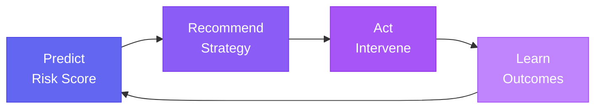

# LoanGuard: Decision Intelligence for Loan Recovery


> **Transform loan recovery from reactive collection to intelligent optimization**

LoanGuard is an enterprise-grade **Decision Intelligence** platform that goes beyond prediction to optimize recovery actions. It combines ML-based risk scoring with multi-arm bandits, A/B testing, and causal inference to learn which strategies work best for different borrower profiles.

---

## 🎯 Why Decision Intelligence?

Traditional ML stops at prediction. Decision Intelligence completes the loop:



---

## ✨ Key Features

### Core ML
| Feature | Description |
|---------|-------------|
| **Risk Scoring** | Random Forest classifier with 95% confidence intervals |
| **Borrower Segmentation** | K-Means clustering for actionable risk tiers |
| **Explainability** | SHAP integration for regulatory compliance |

### Decision Intelligence
| Feature | Description |
|---------|-------------|
| **Multi-Arm Bandit** | Thompson Sampling to optimize strategy selection |
| **A/B Testing** | Built-in framework with chi-square significance testing |
| **Outcome Tracking** | Persistent logging to measure real-world impact |
| **What-If Simulator** | Test interventions before committing resources |
| **Causal Analysis** | Distinguish correlation from causation |

### Enterprise Ready
| Feature | Description |
|---------|-------------|
| **Audit Trail** | JSONL logging of all predictions and decisions |
| **Customer 360** | Complete borrower view with procedural activity history |

---

## 🛠️ Technology Stack

```
Frontend        │ Streamlit (Modular UI Architecture)
Data            │ Pandas, NumPy
ML              │ Scikit-learn (Random Forest, K-Means)
Explainability  │ SHAP (Shapley Values)
Optimization    │ Thompson Sampling, Contextual Bandits
Statistics      │ SciPy (chi-square, beta distributions)
Visualization   │ Plotly Express & Graph Objects
```

---

## 📂 Project Structure

```
loanguard/
├── app.py                      # Application entry point
├── config/
│   └── settings.py             # Centralized configuration
├── data/
│   ├── loan-recovery.csv       # Synthetic loan dataset
│   └── logs/                   # Decision audit logs
├── models/                     # Trained model artifacts
├── scripts/
│   ├── generate_data.py        # Data generation with correlations
│   └── train_model.py          # Model training pipeline
├── src/
│   ├── model.py                # Risk & Segment models
│   ├── features.py             # Feature engineering
│   ├── decision_log.py         # Audit trail logging
│   ├── ab_testing.py           # A/B testing framework
│   ├── optimizer.py            # Multi-arm bandit engine
│   └── ui/
│       ├── dashboard.py        # Executive overview
│       ├── portfolio.py        # Loan book management
│       ├── risk_engine.py      # Statistical analysis
│       ├── customer_360.py     # Single borrower view
│       ├── what_if.py          # Scenario simulator
│       └── analytics.py        # DI analytics hub
└── tests/                      # Unit tests
```

---

## ⚡ Quick Start

### Prerequisites
- Python 3.9+

### Installation

```bash
# Clone repository
git clone https://github.com/BLShaw/LoanGuard
cd LoanGuard

# Install dependencies
pip install -r requirements.txt

# Generate training data
python scripts/generate_data.py

# Train models
python scripts/train_model.py

# Launch dashboard
streamlit run app.py
```

---

## 🖥️ Dashboard Views

### 1. Executive Dashboard
Real-time portfolio health with recovery rates and exposure visualization.


### 2. Portfolio Management
Filterable loan book with borrower journey flow diagrams.


### 3. What-If Simulator
Test parameter changes and see predicted impact with confidence intervals.

### 4. Analytics Hub
Track outcomes, run A/B tests, and analyze causal effects.

### 5. Customer 360
Single borrower deep-dive with SHAP explanations and activity timeline.


---

## 🧠 Decision Intelligence Components

### Thompson Sampling (Multi-Arm Bandit)
```python
# The optimizer learns which strategies work best
recommendation = optimizer.recommend_action(
    risk_score=0.72,
    segment="High Loan, High Risk",
    explore=True  # Balance exploration vs exploitation
)
# Returns: ActionRecommendation(action="Legal Action", confidence=0.85, ...)
```

### A/B Testing Framework
```python
# Create randomized experiments
test_id = ab_framework.create_test(
    test_name="Settlement vs Legal",
    strategies=["Settlement Offer", "Legal Action"],
    use_thompson_sampling=True  # Adaptive allocation
)

# Check significance
significance = ab_framework.calculate_significance(test_id)
# Returns: {'significant': True, 'p_value': 0.023, ...}
```

### Outcome Tracking
```python
# Log actual results to measure model performance
logger.record_outcome(
    borrower_id="BRW_123",
    predicted_risk_score=0.72,
    predicted_strategy="Legal Action",
    actual_outcome="Fully Recovered",
    days_to_resolution=45
)
```

---

## 📊 Model Performance

| Metric | Value |
|--------|-------|
| Risk Model Accuracy | ~85% |
| Feature Correlations | Validated (all signs correct) |
| Confidence Intervals | 95% from tree variance |

---

## 🤝 Contributing

1. Fork the repository
2. Create a feature branch (`git checkout -b feature/NewFeature`)
3. Commit your changes (`git commit -m 'Add NewFeature'`)
4. Push to the branch (`git push origin feature/NewFeature`)
5. Open a Pull Request

---

## 📄 License

This project is available under the [MIT License](LICENSE).

---

